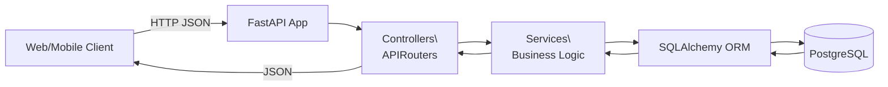
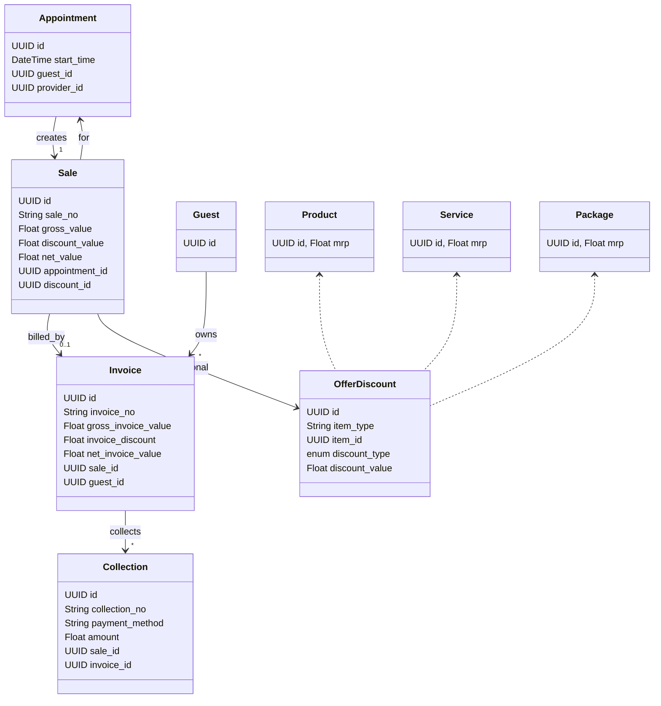
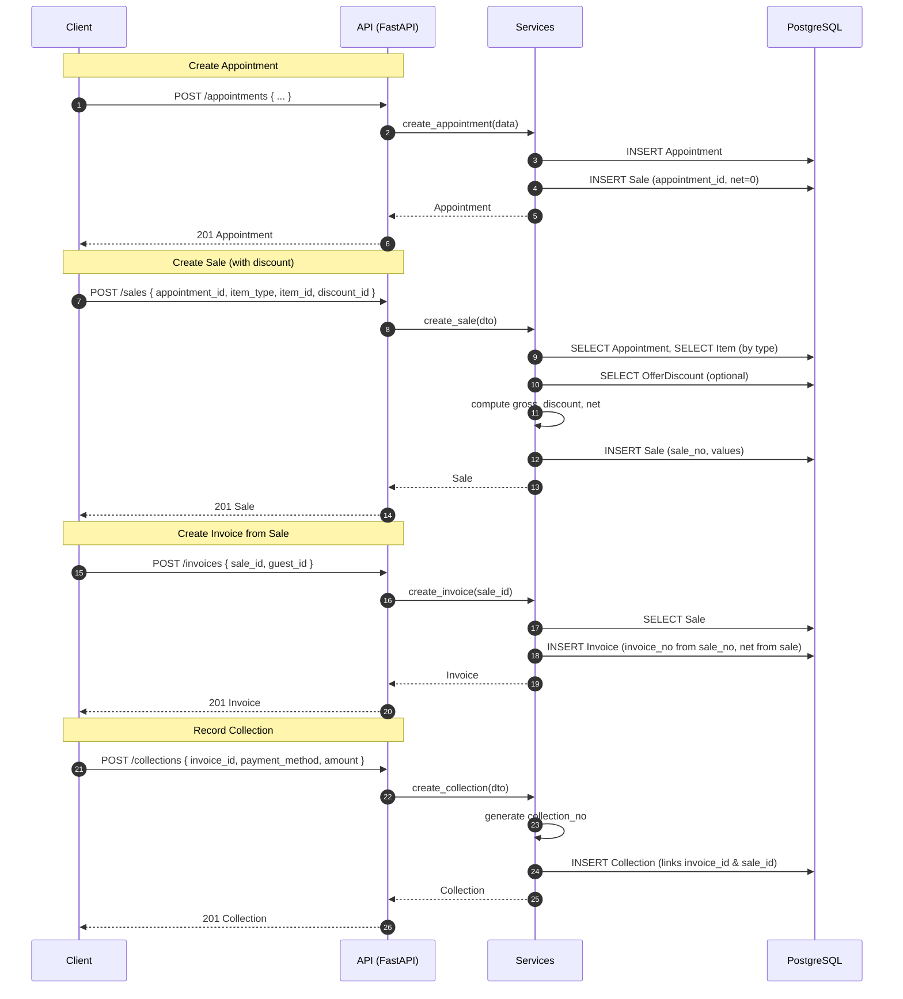

## System Architecture Overview

This backend is a FastAPI application with layered architecture:

- Framework: FastAPI with `APIRouter`s in `controllers/`
- Business logic: functions in `services/`
- Persistence: SQLAlchemy ORM models in `models/`, PostgreSQL database, sessions via `database/db.py`
- Migrations: Alembic in `alembic/`
- Schemas: Pydantic request/response models in `schemas/`

New/changed since latest update:
- Sales are linked one-to-one with Appointments and feed Invoice creation.
- Offers & Discounts can be applied at sale time (fixed/percentage) affecting net values.
- Collections reference both Invoice and Sale; collection numbers are generated server-side.
- Invoice creation derives `invoice_no` from `sale_no` and sets `net_invoice_value` from the Sale.

### High-level Architecture

```
+----------------------+        HTTP (CORS)        +------------------+
|  Web / Mobile Client |  ---------------------->  |   FastAPI App    |
+----------------------+                            +------------------+
                                                          |
                                                          v
                                                 +------------------+
                                                 |  APIRouter(s)    |
                                                 |  controllers/*   |
                                                 +------------------+
                                                          |
                                                          v
                                                 +------------------+
                                                 |   Services       |
                                                 |   services/*     |
                                                 +------------------+
                                                          |
                                                          v
                                                 +------------------+
                                                 | SQLAlchemy ORM   |
                                                 |   models/*       |
                                                 +------------------+
                                                          |
                                     (SessionLocal)       v
                                                 +------------------+
                                                 |   PostgreSQL     |
                                                 +------------------+
                                                          ^
                                                          |
                                                 +------------------+
                                                 |    Alembic       |
                                                 |  migrations/*    |
                                                 +------------------+
```

### Request Lifecycle

```
+--------+      +----------------+      +----------------+      +-----------+      +-----------+
| Client | ---> |  Controller    | ---> |    Service     | ---> |  Session  | ---> | Postgres  |
+--------+      | (APIRouter)    |      | (business logic)|     | (SQLAlchemy)|    | (DB)      |
                +----------------+      +----------------+      +-----------+      +-----------+
                      |                          |                    ^                   |
                      |  JSON in/out (schemas)   |  ORM operations    |  SQL statements   |
                      +--------------------------+--------------------+-------------------+

Flow:
1. Client sends HTTP request (JSON, path/query).
2. Controller validates with Pydantic schema and injects Session via Depends(get_db).
3. Controller calls Service with DTOs and Session.
4. Service performs ORM queries/commands using Session.
5. Database responds; objects mapped back and returned as response_model JSON.

Notes on recent flows:
- Creating an Appointment auto-creates a placeholder Sale linked to it.
- Creating a Sale requires `appointment_id`, `item_type`, `item_id`, and optional `discount_id`; totals are computed.
- Creating an Invoice requires `sale_id` and derives number/amounts from the Sale.
```

### Key Modules

- `main.py`: creates `FastAPI` app, mounts all routers, configures CORS
- `database/db.py`: builds engine, `SessionLocal`, `Base`, `get_db()` dependency
- `controllers/*`: define URL prefixes and endpoints; inject `Session` and call services
- `services/*`: implement CRUD/use-cases; work with ORM models
- `models/*`: SQLAlchemy models, mapped to PostgreSQL tables
- `schemas/*`: Pydantic models for request/response validation and serialization
- `alembic/*`: migrations using metadata from `database.db.Base`

## API Surface and Workflows

Below is a concise list of endpoints grouped by controller, with typical workflow per group. All endpoints use `Depends(get_db)` to obtain a scoped SQLAlchemy `Session`.

### Users (`/users`)
- POST `/` → create user (hash password in service)
- GET `/` → list users (paginated via `skip`, `limit`)

Workflow: validate via `schemas.user_schema`, ensure unique email, hash password (`passlib`), persist `models.user.User`, return `UserResponse`.

### Guests (`/guests`)
- POST `/` → register guest
- GET `/` → list guests
- GET `/{guest_id}` → fetch guest by id
- GET `/code/{guest_code}` → fetch guest by code
- PUT `/{guest_id}` → update guest
- DELETE `/{guest_id}` → delete guest
- GET `/{guest_id}/appointments` → guest appointments
- GET `/{guest_id}/invoices` → guest invoices

Workflow: controller calls guest service CRUD; related lookups join/filter by `guest_id`; returns schema responses.

### Appointments (`/appointments`)
- GET `/` → list appointments (supports filters)
- POST `/` → create appointment
- GET `/{appointment_id}` → get appointment
- PATCH `/{appointment_id}` → update appointment
- GET `/slots/` → get slots by date (availability view)
- GET `/{appointment_id}/sale` → sale linked to appointment

Workflow: create inserts `Appointment`; service also auto-creates `Sale` with `appointment_id` then returns appointment. Listing uses optional filters (provider/center/date range).

### Centers (`/centers`)
- POST `/` → create center
- GET `/` → list centers
- GET `/{center_id}` → get center
- GET `/{center_id}/guests` → center guests
- GET `/{center_id}/appointments` → center appointments

Workflow: basic CRUD and relationship queries by `center_id`.

### Services (`/services`)
- POST `/` → create service
- GET `/` → list services
- GET `/{service_id}` → get service
- PUT `/{service_id}` → update service
- DELETE `/{service_id}` → delete service

Workflow: typical CRUD on `models.service.Service` via `services.service_services`.

### Providers (`/providers`)
- POST `/` → create provider
- GET `/` → list providers
- GET `/{provider_id}` → get provider

Workflow: CRUD via `services.provider_service`.

### Rooms (`/rooms`)
- GET `/` → list rooms
- GET `/{room_id}` → get room
- POST `/` → create room
- PUT `/{room_id}` → update room

Workflow: CRUD via `services.room_service`.

### Room Categories (`/room-categories`)
- GET `/` → list categories
- GET `/{category_id}` → get category
- POST `/` → create category
- PUT `/{category_id}` → update category

Workflow: CRUD via `services.room_category_service`.

### Products (`/products`)
- GET `/` → list products
- POST `/` → create product
- PATCH `/{product_id}` → update product

Workflow: CRUD via `services.product_service` and `models.products.Product`.

### Offers & Discounts (`/offers-discounts`)
- POST `/` → create discount/offer
- GET `/` → list offers
- GET `/{offer_id}` → get offer
- PUT `/{offer_id}` → update offer

Workflow: `OfferDiscount` supports `item_type` (product/service/package) and `discount_type` (fixed/percentage). Applied at sale time to compute `discount_value`.

### Employees (`/employees`)
- POST `/` → create employee
- GET `/` → list employees
- GET `/{emp_id}` → get employee
- PUT `/{emp_id}` → update employee

Workflow: CRUD via `services.employee_service`.

### Business Units (`/business-units`)
- GET `/` → list business units
- GET `/{bu_id}` → get business unit
- POST `/` → create business unit
- PUT `/{bu_id}` → update business unit
- DELETE `/{bu_id}` → delete business unit

Workflow: CRUD via `services.business_unit_service`.

### Categories (`/categories`)
- GET `/` → list categories
- GET `/{category_id}` → get category
- POST `/` → create category
- PUT `/{category_id}` → update category
- DELETE `/{category_id}` → delete category

Workflow: CRUD via `services.category_service`.

### Packages (`/packages`)
- GET `/` → list packages
- GET `/{package_id}` → get package
- POST `/` → create package
- PUT `/{package_id}` → update package
- DELETE `/{package_id}` → delete package

Workflow: CRUD via `services.package_service`.

### Invoice Items (`/invoice-items`)
- POST `/` → create invoice item
- GET `/invoice/{invoice_id}` → list items for invoice
- GET `/{item_id}` → get item
- PUT `/{item_id}` → update item
- DELETE `/{item_id}` → delete item

Workflow: item CRUD bound to invoice via FK, using `services.invoice_item_service`.

### Invoices (`/invoices`)
- POST `/` → create invoice
- GET `/` → list invoices
- GET `/{invoice_id}` → get invoice
- PUT `/{invoice_id}` → update invoice
- DELETE `/{invoice_id}` → delete invoice
- POST `/get-or-create/{guest_id}` → idempotent fetch-or-create for a guest
- GET `/{invoice_id}/collections` → list collections for invoice

Workflow: create takes `sale_id` (schema also includes `guest_id`), loads the sale, generates `invoice_no` using `sale_no`, and sets `net_invoice_value` from the sale. `get-or-create` (if enabled) checks existing open invoice for guest and creates if absent.

### Invoice Payments (`/payments`)
- POST `/` → create invoice payment
- GET `/{payment_id}` → get payment
- GET `/invoice/{invoice_id}` → list payments for invoice
- PUT `/{payment_id}` → update payment
- DELETE `/{payment_id}` → delete payment

Workflow: CRUD for payments linked to invoices; updates totals downstream via service logic.

### Sales (`/sales`)
- POST `/` → create sale
- GET `/` → list sales
- GET `/{sale_id}` → get sale
- PUT `/{sale_id}` → update sale
- DELETE `/{sale_id}` → delete sale

Workflow: explicit sale creation fetches the item (product/service/package) MRP, applies optional `OfferDiscount`, and computes `gross_value`, `discount_value`, `net_value`. A `sale_no` is auto-generated. Sales link one-to-one with an appointment and one-to-one with an invoice.

### Collections (`/collections`)
- POST `/` → create collection (receipt/collection against invoice)
- GET `/` → list collections (supports skip/limit)
- GET `/{col_id}` → get collection
- PUT `/{col_id}` → update collection
- DELETE `/{col_id}` → delete collection

Workflow: collection entries reference both `invoice_id` and `sale_id`; `collection_no` is generated server-side. Totals roll up to the invoice.

## Data and DB Layer

- Engine/Session: built in `database/db.py` using env vars; `Depends(get_db)` handles lifecycle per-request
- Models: mapped with `Base = declarative_base()`; IDs commonly PostgreSQL `UUID`
- Migrations: `alembic/env.py` loads `Base.metadata` so new models require generating migrations

```
+-----------+     has      +-------------+     creates     +--------+
|  GUEST    |  --------->  | APPOINTMENT |  ----------->  |  SALE  |
+-----------+               +-------------+                +--------+
      |  billed                         ^  hosts                 ^ performs
      v                                 |                        |
+-----------+   contains   +-------------+   scheduled_in   +-----------+
|  INVOICE  | <----------- |  INVOICE_ITEM| <-------------- |   ROOM    |
+-----------+               +-------------+                  +-----------+
      |  paid_by     collected_by
      v                   v
+----------------+   +-------------+
| INVOICE_PAYMENT|   | COLLECTION  |
+----------------+   +-------------+

+-----------+     for       +-------------+
| SERVICE   |  ---------->  | APPOINTMENT |
+-----------+                +-------------+

+-----------+     sold in   +-------------+
| PRODUCT   |  ---------->  | INVOICE_ITEM|
+-----------+                +-------------+

+-----------+
|  CENTER   | -- hosts --> APPOINTMENT
+-----------+
```

## Security & Cross-cutting Concerns

- CORS allows `http://localhost:5173` and `http://127.0.0.1:5173`
- Passwords hashed via `passlib` (`bcrypt`) in user service
- No global auth/authorization middleware detected; add JWT/OAuth2 as needed

## Local Development

- Environment: set `POSTGRES_*` variables or `.env`
- Run app: `uvicorn main:app --reload`
- Apply migrations: `alembic revision --autogenerate -m "msg" && alembic upgrade head`

## Mermaid Diagrams








